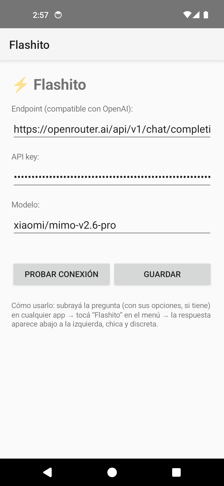
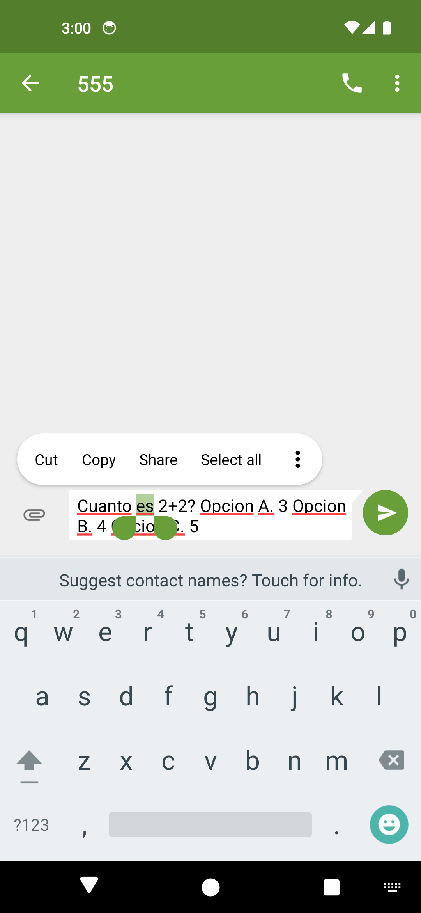
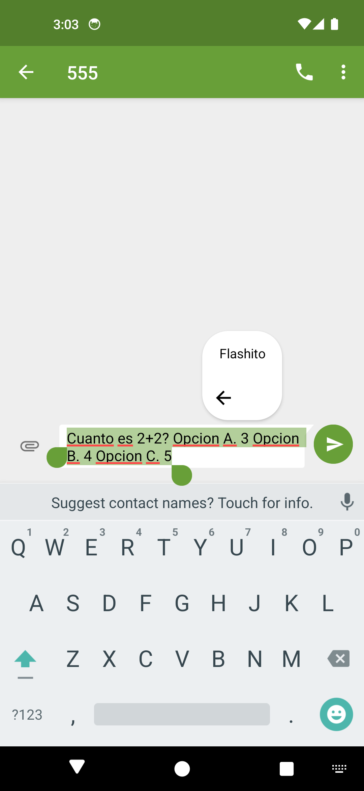

# Emulador Android para Flashito

Entorno reproducible de Android Emulator creado para desarrollar y probar **Flashito** sin necesitar un teléfono físico.

El proyecto configura automáticamente un dispositivo virtual basado en **Pixel 5**, con Android 14 (API 34), arquitectura x86_64, cuatro núcleos, resolución 1080 × 2340 y 6 GB de almacenamiento virtual.

## Demostración

| Configuración de Flashito | Selección de texto | Integración en Android |
|---|---|---|
|  |  |  |

## ¿Para qué sirve?

- Probar APKs de Flashito y otras aplicaciones Android.
- Reproducir el flujo de selección de texto de `ACTION_PROCESS_TEXT`.
- Depurar instalación, interfaz, permisos y conectividad mediante ADB.
- Crear capturas y demostraciones en un entorno aislado y repetible.

## Características

- Perfil Pixel 5 con Android 14/API 34.
- Arquitectura x86_64 con aceleración gráfica.
- 4 núcleos y 1536 MB de RAM configurados.
- Pantalla 1080 × 2340 a 440 dpi.
- Almacenamiento virtual de 6 GB.
- Inicio rápido mediante snapshots del Android Emulator.
- Scripts para crear, iniciar e instalar APKs.
- No incluye imágenes del sistema, snapshots ni credenciales personales.

## Requisitos

1. Windows 10 u 11 con virtualización habilitada.
2. Android SDK Command-line Tools.
3. Java 17 configurado en `JAVA_HOME` o disponible en `PATH`.
4. Conexión a Internet durante la instalación inicial de la imagen Android.

## Crear el emulador

Abre PowerShell en esta carpeta y ejecuta:

```powershell
powershell -ExecutionPolicy Bypass -File .\scripts\setup-emulator.ps1
```

El script instala los componentes oficiales necesarios mediante `sdkmanager` y crea un AVD llamado `Flashito`.

## Iniciar el emulador

```powershell
powershell -ExecutionPolicy Bypass -File .\scripts\start-emulator.ps1
```

## Instalar Flashito u otro APK

Con el emulador iniciado:

```powershell
powershell -ExecutionPolicy Bypass -File .\scripts\install-apk.ps1 -ApkPath "C:\ruta\Flashito.apk"
```

## Seguridad y licencias

Este repositorio distribuye únicamente la configuración y automatización. Las imágenes oficiales de Android se descargan directamente desde Google mediante Android SDK. No se publican snapshots ni particiones del AVD porque pueden contener API keys, aplicaciones instaladas y otros datos privados.
